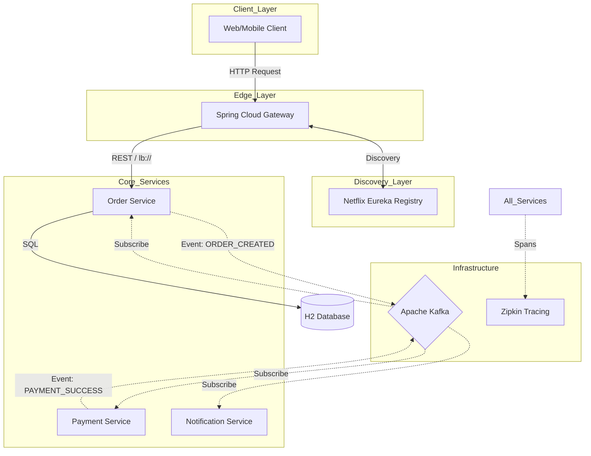

# 🏗️ Application Design Document: Microservice E-Commerce System

## 1. Executive Summary
This document outlines the architectural design for a production-grade, event-driven microservices ecosystem. The system is designed to handle e-commerce operations (Orders, Payments, Notifications) with a focus on high availability, scalability, and loose coupling.

---

## 2. System Architecture
The system follows a **Cloud-Native Microservices Architecture** using Spring Cloud and Apache Kafka.

### 2.1 High-Level Architecture Map

---

## 3. Technology Stack

| Component | Technology | Rationale |
| :--- | :--- | :--- |
| **Framework** | Spring Boot 3.x | Industry standard for Java microservices. |
| **Gateway** | Spring Cloud Gateway | Reactive, non-blocking routing and cross-cutting concerns. |
| **Registry** | Netflix Eureka | AP-based service discovery for high availability. |
| **Messaging** | Apache Kafka | Distributed event streaming for Saga orchestration. |
| **Database** | H2 (In-Memory) | Lightweight for demonstration; replaceable with PostgreSQL/MySQL. |
| **Observability** | Micrometer + Zipkin | Distributed tracing for request visualization. |
| **Resilience** | Resilience4j | Circuit breaker and fallback mechanisms. |
| **Containerization** | Docker / Docker Compose | Environment parity and easy orchestration. |

---

## 4. Service Breakdown

### 4.1 API Gateway (`api-gateway`)
- **Role**: Single entry point for all clients.
- **Responsibilities**:
    - Request Routing (via Eureka).
    - Global Logging (Custom `GlobalFilter`).
    - Fault Tolerance (Resilience4j Circuit Breakers).
    - Response timing and security enforcement.

### 4.2 Order Service (`order-service`)
- **Role**: Manages order lifecycle.
- **Data Model**: `Order` (ID, Product, Price, Status).
- **Behavior**:
    - Creates orders in `PENDING` state.
    - Publishes `ORDER_CREATED` events to Kafka.
    - Listens for `PAYMENT_SUCCESS` or `PAYMENT_FAILED` to update status.

### 4.3 Payment Service (`payment-service`)
- **Role**: Handles transaction processing.
- **Behavior**:
    - Consumes `ORDER_CREATED` events.
    - Simulates payment logic (success/fail).
    - Publishes result events to `payment-events` topic.

### 4.4 Notification Service (`notification-service`)
- **Role**: Handles external communications (email/SMS simulation).
- **Behavior**:
    - Consumes events from Kafka.
    - Dispatches notifications asynchronously without blocking core flows.

---

## 5. Design Patterns & Principles

### 5.1 Saga Pattern (Choreography)
To maintain data consistency across distributed services without distributed transactions (2PC), we use **Choreography-based Saga**.
- **Process**: Order Service (Start) -> Kafka -> Payment Service -> Kafka -> Order Service (Complete/Compensate).
- **Benefit**: No single point of failure (Orchestrator) and low coupling.

### 5.2 API Gateway Pattern
Centralizes cross-cutting concerns (Security, Monitoring, Rate Limiting) to keep microservices lean and focused on business logic.

### 5.3 Database per Service
Each service owns its data. This ensures that a schema change in the Payment service never breaks the Order service.

### 5.4 Sidecar Pattern (Conceptual)
While implemented via libraries in this project, the design is ready for a Service Mesh (like Istio) where network concerns are offloaded to a proxy.

---

## 6. Data & Messaging Flow

### 6.1 Kafka Topic Strategy
- `order-events`: Captured by Payment and Notification services.
- `payment-events`: Captured by the Order service for state transitions.

### 6.2 Transactional Integrity
We rely on **Eventual Consistency**. The system guarantees that once a message is published to Kafka, it will eventually be processed by the target service, even if that service is temporarily down (via Kafka retries).

---

## 7. Reliability & Observability

### 7.1 Circuit Breaker Implementation
The API Gateway uses Resilience4j to wrap calls to downstream services.
- **State**: Closed (Normal) -> Open (Failure threshold met) -> Half-Open (Testing recovery).
- **Fallback**: Returns a cached response or a "Service Unavailable" message instead of timing out.

### 7.2 Distributed Tracing
Every request is assigned a `Trace ID`. This ID propagates across:
1. API Gateway (REST)
2. Order Service (REST -> Kafka)
3. Payment/Notification Services (Kafka)
This allows us to visualize the entire request waterfall in **Zipkin**.

---

## 8. Deployment Architecture
- **Environment**: Containerized using Docker.
- **Orchestration**: `docker-compose.yml` defines the network and startup order (using `depends_on`).
- **Scaling**: Each service is stateless, allowing `docker-compose up --scale order-service=3` for horizontal scaling.

---

## 9. Security Considerations
- **Boundary Security**: The API Gateway should serve as the OAuth2 Resource Server.
- **Internal Security**: Microservices should communicate over a private network (Docker bridge), with optional mTLS for production environments.
