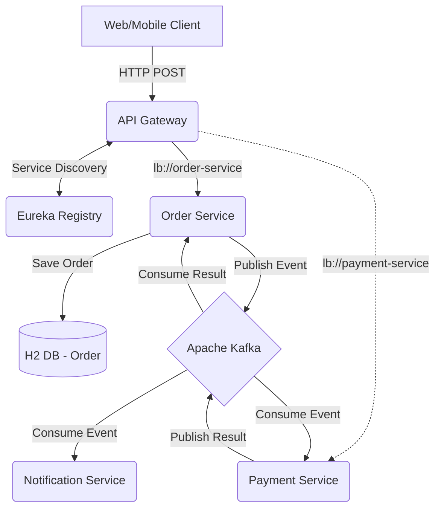
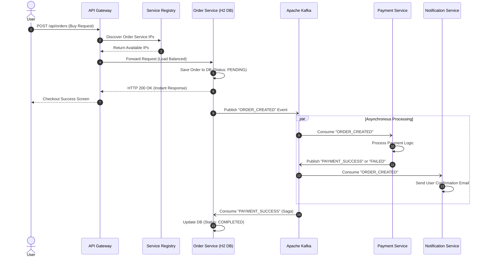

# 🎤 Microservices Interview Guide & Architecture Explanation

This document is your definitive study guide. It breaks down every single architectural decision in this codebase, explaining *how* it works and *how to talk about it* in a technical interview.

---

## 1. Microservices Architecture Overview
**The Concept:** Instead of building one giant "Monolith", we split our application into small, loosely coupled services based on business domains (Order, Payment, Notification). 

**System Architecture Map:**

**The Benefit:** Independent deployments, targeted scaling, and fault isolation.

**In an Interview:** 
> *"In my recent project, we decoupled our monolithic backend into domain-driven microservices. For instance, if the Notification Service goes down, the Order Service can still process orders, ensuring high availability for critical business flows."*

---

## 2. API Gateway & Load Balancing
**The Tool:** Spring Cloud Gateway
**How it works:** The Gateway acts as the single entry point for all client applications (React, Angular, Mobile). Clients never talk to microservices directly.

**Load Balancing (`lb://`):** 
In our `application.yml`, we route traffic using `uri: lb://order-service`. The `lb` prefix tells the Gateway to use **Spring Cloud LoadBalancer**. It automatically contacts Eureka, gets all IP addresses running the `order-service`, and uses a Round-Robin algorithm to distribute the requests evenly.

**In an Interview:**
> *"I use Spring Cloud Gateway as my API Gateway. It simplifies the client side by providing a single endpoint. For load balancing, the Gateway integrates with Eureka using the `lb://` routing prefix. This dynamically distributes traffic across multiple instances of a service without needing a physical load balancer like NGINX."*

---

## 3. Service Discovery
**The Tool:** Netflix Eureka
**How it works:** Microservices spin up on dynamic Docker IPs. They register their IP and Port with the Eureka Server. When the API Gateway needs to call the Order Service, it asks Eureka "Where is the Order Service?" and Eureka provides the address.

**In an Interview:**
> *"We use Netflix Eureka for Service Discovery. It prevents hardcoding IP addresses. Services register themselves on startup, and components like the API Gateway query Eureka to dynamically discover the location of downstream services."*

---

## 4. Cross-Cutting Concerns (Logging & Security)
A "cross-cutting concern" is logic that applies to the entire system. Instead of duplicating logging and security code inside every single microservice, we centralize it at the API Gateway.

**Logging Filter:**
In this project, we added a `LoggingGlobalFilter.java`. It implements `GlobalFilter` to intercept every incoming request. It logs the incoming path, starts a timer, passes the request to the microservice, and logs the total response time upon return.

**Security (OAuth2 / JWT):**
Although omitted here for brevity, the Gateway is the ultimate enforcer of security.

**In an Interview:**
> *"I handle cross-cutting concerns at the API Gateway. For logging, I use a custom `GlobalFilter` to intercept requests, log payloads, and measure response times. For security, I configure the Gateway as an OAuth2 Resource Server. It validates JWT tokens using a `SecurityWebFilterChain`, ensuring that unauthenticated traffic is blocked before it ever reaches the core microservices."*

---

## 5. Synchronous vs. Asynchronous Communication
**Synchronous (REST):** 
The Gateway calling the Payment Service via HTTP. The caller *waits* for the response. Good for immediate data retrieval, but causes tight coupling.
**Asynchronous (Apache Kafka):** 
The Order Service publishes an `Order Created` event to a Kafka topic. The Notification Service consumes it whenever it's ready. The Order Service doesn't wait.

**In an Interview:**
> *"I prefer asynchronous, event-driven communication using Apache Kafka for decoupling. When an order is created, the Order Service publishes an event to Kafka and immediately returns a fast response to the user. The Notification Service consumes this event at its own pace to send emails, ensuring our core flow isn't bottlenecked by third-party email APIs."*

---

## 6. Observability & Distributed Tracing
**The Tools:** Micrometer Tracing & Zipkin
**How it works:** When a request hits the Gateway, Micrometer generates a unique `Trace ID` (e.g., `8d7a1b2c`). As the request travels to the Order Service, and then via Kafka to the Notification Service, that exact same `Trace ID` is injected into the logs. Zipkin aggregates these traces into a visual dashboard.

**In an Interview:**
> *"For monitoring, I implemented Distributed Tracing using Micrometer Observation and Zipkin. It attaches a unique Trace ID to every log line across all microservices. If a user reports an error, I can search that Trace ID in Zipkin and visually see the entire waterfall of the request, instantly identifying exactly which microservice caused the latency or failure."*

---

## 7. API Documentation
**The Tool:** Springdoc OpenAPI (Swagger)
**How it works:** Added via `springdoc-openapi-starter-webmvc-ui`. It scans your `@RestController` classes and automatically generates a beautiful UI to test your endpoints without needing Postman.

**In an Interview:**
> *"To ensure seamless collaboration with frontend teams, I integrated Springdoc OpenAPI. It automatically generates interactive Swagger UI documentation, allowing the team to easily understand the contract and test the REST APIs directly from the browser."*

---

## 8. Microservices Design Patterns Used
Interviewers love asking about design patterns. Here are the specific patterns implemented or conceptualized in this project:

1. **API Gateway Pattern:** Using Spring Cloud Gateway to provide a single, unified entry point for clients, masking the internal architecture and handling cross-cutting concerns.
2. **Service Registry & Discovery Pattern:** Using Netflix Eureka to allow microservices to find each other dynamically without hardcoded IPs.
3. **Database per Service Pattern:** While we only implemented an H2 DB in the Order Service, the architecture relies on the concept that Payment and Order have independent data stores to prevent database locking and coupling.
4. **Event-Driven Architecture / Asynchronous Messaging Pattern:** Using Kafka to decouple the Order Service from the Notification Service. The Order Service acts as a Producer, and the Notification Service acts as a Consumer.
5. **Distributed Tracing Pattern:** Implemented via Zipkin and Micrometer to track requests across boundaries by passing a single Correlation/Trace ID.
6. **Circuit Breaker Pattern:** We implemented Resilience4j in the API Gateway. We wrapped the synchronous call (Gateway -> Payment Service) in a `CircuitBreaker` filter. If the Payment Service is down, instead of returning an error or timing out, it falls back to a custom `FallbackController` in the Gateway which gracefully returns a "Service Unavailable" message, preventing cascading failures.
7. **Saga Pattern / Event Sourcing:** Used for handling distributed transactions without locking databases. There are two main types of Sagas:
    *   **Choreography (Implemented Here):** Decentralized. Each service publishes and listens to events. *How it works in our code:* When an Order is placed, it is saved as "PENDING" and an `ORDER_CREATED` event is fired to Kafka. The Payment Service listens, processes the payment, and fires either `PAYMENT_SUCCESS` or `PAYMENT_FAILED`. The Order Service listens to these events and either finalizes the Order as "COMPLETED" or rolls it back to "FAILED".
    *   **Orchestration (Conceptual):** Centralized. A central "Orchestrator" service (like Camunda) tells each microservice what to do, acting as a state machine. Best for very complex workflows.
8. **Sidecar Pattern (Conceptual / Kubernetes Context):** While we are running plain Docker Compose here, in a Kubernetes environment, you would often deploy a Sidecar container (like Istio Envoy proxy or Fluentd) alongside each microservice container in the same Pod. The sidecar intercepts traffic to handle cross-cutting network concerns (like mTLS security) or logs routing, allowing the main microservice to focus purely on business logic.
9. **CQRS Pattern (Command Query Responsibility Segregation) (Conceptual):** If the application needed to scale heavily, we would split our database operations. The Order Service would act as the "Command" side (writing to a relational Postgres DB) and publish events to Kafka. A separate service would consume those events to update a "Query" side (like an Elasticsearch or MongoDB NoSQL database), which is highly optimized for fast reads and dashboard aggregations without slowing down the write database.

To prevent our write-database from being bogged down by complex dashboard queries, we would implement the CQRS pattern. We use the Order Service strictly for 'Commands' (writing new data to Postgres). It then fires an event to Kafka. A separate service consumes that event and populates a heavily indexed 'Query' database like Elasticsearch or MongoDB, allowing us to serve lightning-fast reads without impacting transactional performance."

---

## 9. The CAP Theorem in our Architecture
**The Concept:** The CAP Theorem states that in a distributed system, you can only provide two out of three guarantees: **C**onsistency, **A**vailability, and **P**artition Tolerance.

*   **Consistency (C):** Every read receives the most recent write or an error.
*   **Availability (A):** Every request receives a (non-error) response, without the guarantee that it contains the most recent write.
*   **Partition Tolerance (P):** The system continues to operate despite an arbitrary number of messages being dropped (or delayed) by the network between nodes.

In modern microservices, **Partition Tolerance (P) is non-negotiable** because network failures are inevitable. Therefore, we must choose between **CP** (Consistency) or **AP** (Availability).

**How we applied it in this project:**
We generally favor **AP (Availability)** to ensure the system stays responsive and provides a seamless user experience.

1.  **Service Discovery (Eureka) -> AP:**
    Netflix Eureka is a classic AP system. During a network partition, Eureka nodes prefer to serve potentially "stale" registration data rather than no data at all. It's better for the API Gateway to try an old IP address of the Order Service than to return a 500 error because it "can't find" any service.
2.  **Order Processing (Saga Pattern) -> AP (Eventual Consistency):**
    We chose **Eventual Consistency** over Strong Consistency. When a user buys an item, the Order Service saves it as `PENDING` and returns `200 OK` immediately (**High Availability**). We don't wait for the Payment Service to respond. The system eventually becomes consistent when Kafka delivers the `PAYMENT_SUCCESS` event to the Order Service.

**In an Interview:**
> *"In a microservices environment, network partitions are a reality, so I design for **AP (Availability and Partition Tolerance)**. For instance, I used Eureka for service discovery because it's an AP system that prioritizes availability over perfect consistency during network issues. For business logic, I implement the **Saga Pattern** with Kafka. This allows our 'Order' flow to be **Eventually Consistent**—we provide the user with an immediate success response (Availability) while the payment and notifications are processed asynchronously in the background."*

---

## 10. CI/CD & Deployment Strategies
Interviewers often ask how you push new microservice versions to production without causing downtime.

**The Strategy: Blue-Green Deployment**
Blue-Green deployment is a technique that reduces downtime and risk by running two identical production environments called Blue and Green.

**How it works:**
*   **Blue** is the currently active, live environment receiving 100% of user traffic (e.g., version 1.0 of the Order Service).
*   **Green** is the idle environment. Your CI/CD pipeline (e.g., Jenkins or GitHub Actions) builds the new version (1.1) and deploys it entirely to the Green environment.
*   Once the Green environment passes all automated and manual sanity checks, the router (like an API Gateway or AWS Route 53) is flipped so 100% of traffic is redirected to Green.
*   If a critical bug is found, you can instantly rollback by flipping the router back to Blue.

**In an Interview:**
> *"To ensure zero-downtime releases, I advocate for Blue-Green deployments in our CI/CD pipelines. We deploy the new microservice version to an idle 'Green' environment. Once it passes health checks and integration tests, we instantly switch the API Gateway traffic over to it. This provides a safety net—if anything goes wrong, we can instantly rollback to the 'Blue' environment with zero impact on the end user."*

---

## 11. End-to-End Architecture Flow (The 'Order' Journey)
Interviewers frequently ask: *"Walk me through exactly what happens in your architecture when a user clicks 'Buy'."* 

Here is the exact step-by-step design flow of our application:

1. **Client Request:** The user submits an order. The request hits the **API Gateway** (`http://localhost:8080/api/orders`).
2. **Cross-Cutting Concerns:** The Gateway intercepts the request using our `LoggingGlobalFilter` to start performance tracking, and assigns a **Micrometer Trace ID** to the request.
3. **Service Discovery & Load Balancing:** The Gateway checks with **Eureka** to find an available instance of the **Order Service**. It uses a Round-Robin load balancer to forward the request.
4. **Local Transaction (Command):** The Order Service receives the payload, saves the Order in its local H2 Database with a status of `"PENDING"`, and immediately returns an HTTP 200 response to the user. (This keeps the API blazing fast).
5. **Event Publication:** Behind the scenes, the Order Service publishes an `ORDER_CREATED` event to the **Kafka Message Broker**.
6. **Saga Choreography (Payment):** The **Payment Service** is listening to Kafka. It picks up the `ORDER_CREATED` event, simulates charging a credit card, and publishes a new event: `PAYMENT_SUCCESS` (or `FAILED`). 
7. **Saga Rollback/Commit:** The Order Service listens to the payment event. If it sees `SUCCESS`, it updates the database to `"COMPLETED"`. If it sees `FAILED`, it rolls the order back to `"FAILED"`.
8. **Asynchronous Notification:** Meanwhile, the completely decoupled **Notification Service** also listened to the Kafka events and simulated sending a confirmation email to the user.

**In an Interview:**
> *"When a user clicks 'Buy', the request hits the API Gateway, which handles security and generates a distributed Trace ID. The Gateway queries Eureka and load-balances the request to the Order Service. To ensure the user isn't kept waiting, the Order Service saves a 'PENDING' record and immediately returns a success response. It then asynchronously publishes an event to Kafka. Our Payment Service picks up this event, processes the charge, and publishes a success event, which the Order Service uses to finalize the transaction via Saga Choreography. Simultaneously, a Notification Service consumes the event to send an email. This event-driven flow ensures high availability, extremely low latency for the user, and decoupled scalability."*
